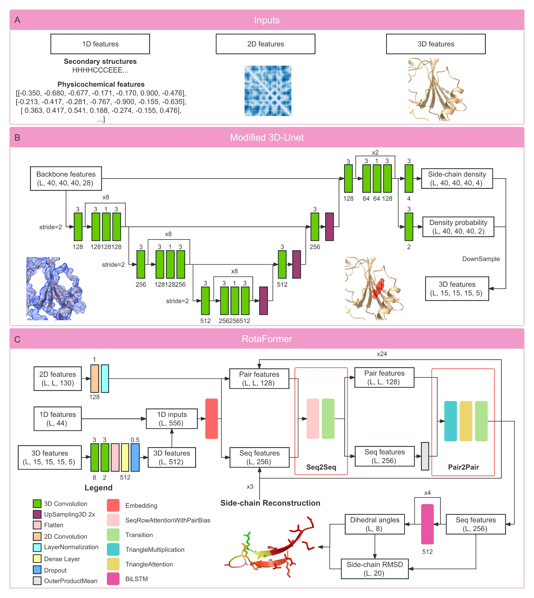

# OPUS-Rota5

Accurate protein side-chain modeling is crucial for protein folding and design. This is particularly true for molecular docking as ligands primarily interact with side chains. Previous research on AlphaFold2 (AF2) predictions of GPCR targets indicates that the docking of natural ligands back on AF2-predicted structures has limited success rate presumably due to large errors in side chains. Here, we introduce a two-stage side-chain modeling approach called OPUS-Rota5. It leverages a modified 3D-Unet to capture the local environmental features including ligand information of each residue, and then employs RotaFormer module to aggregate various types of feature. Evaluation on three test sets, including recently released targets from CAMEO and CASP15, reveals that side chains modeled by OPUS-Rota5 are significantly more accurate than those predicted by other methods. We also employ OPUS-Rota5 to refine the side chains of 25 GPCR targets predicted by AF2 and a significantly improved success rate is observed when docking of their natural ligands back using both AutoDock-Vina and Dock6.10. Such results suggest that OPUS-Rota5 could be a valuable tool for molecular docking, particularly for targets with relatively accurate predicted backbones, such as high-homology targets.



## Usage

### Dependency

```
Python 3.7
TensorFlow 2.4
```

The standalone version of OPUS-Rota5 is hosted on [Google Drive](xxx). The three side-chain modeling test sets (CAMEO65, CASP15, and CAMEO82) and the docking test set (25 GPCRs) can be downloaded directly from [Here](xxx).
